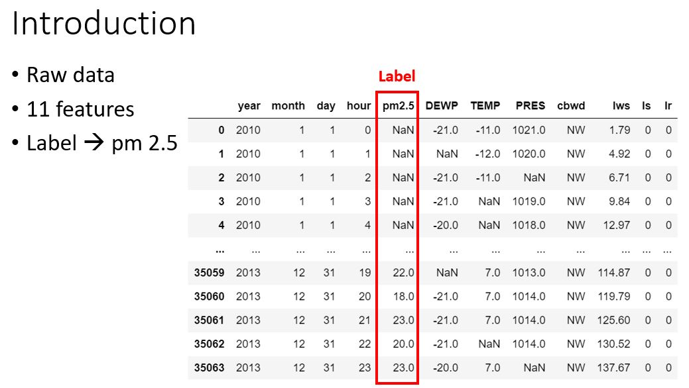

# PM-2.5-prediction
It's a second mid project of Data Science Applications course in NCTU.
# Data description

# Contents
- Visualization
   - line graph, bar chart, box plot, feature correlation analysis(heat map)
- Preprocessing
   - Filling missing values
   - One-hot encoding
   - Normalization
   - Feature selection
- Methods
   - LSTM
   - Random Forest
   - Support Vector Regression
   - XGBoost
